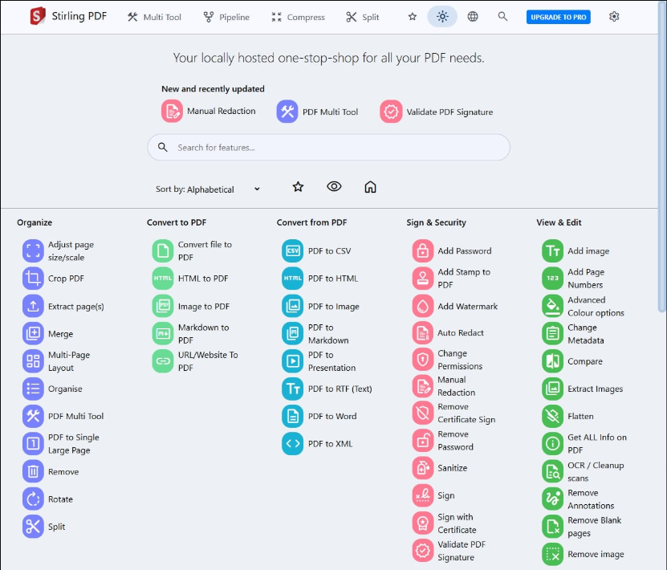

一说到pdf，各位大部分想到的是adobe家的pdf吧，因为它的易用性，人性化的设计，很多人都会选择他（有点贵😁,所以……😉）。

> 但是编辑pdf是不容易的！

> 今天给大家介绍的GitHub项目就能够解决你的大部分在pdf上的痛点，这个项目就是[Stirling-PDF](https://github.com/Stirling-Tools/Stirling-PDF)，现在有了50多k的stars

##### Stirling-pdf介绍
看一下他的about：
> #1 Locally hosted web application that allows you to perform various operations on PDF files

README文档：
> Stirling-PDF is a robust, locally hosted web-based PDF manipulation tool using Docker. It enables you to carry out various operations on PDF files, including splitting, merging, converting, reorganizing, adding images, rotating, compressing, and more. This locally hosted web application has evolved to encompass a comprehensive set of features, addressing all your PDF requirements.

    All files and PDFs exist either exclusively on the client side, reside in server memory only during task execution, or temporarily reside in a file solely for the execution of the task. Any file downloaded by the user will have been deleted from the server by that point.

    Homepage: https://stirlingpdf.com

    All documentation available at https://docs.stirlingpdf.com/

##### Stirling-pdf优点
- 广泛的 PDF 功能：访问 50+ 工具，包括签名、转换、合并等。
- 高级定制：深度自定义、主题和环境变量。
- 企业功能：SSO、用户管理和权限控制。
- 数据安全：本地文件处理，任务后自动删除。
- 可扩展性和自动化：使用 Docker 和 Kubernetes 支持进行批处理。
- API 集成：使用 API 实现自动化和外部集成。
- 开源：社区驱动，提供频繁更新和 GitHub 支持。
- 多语言支持：提供 38+ 种语言版本，并有有效翻译。

stirling-pdf十分人性化，有提供[网页版本](https://www.stirlingpdf.com/)，只要拖动文件到网页，就可以快速处理pdf，速度可比一些付费软件快多了（大家可以去试试），另外，他也提供了pdf合并加密、添加水印、签名、OCR等很多功能（网站也可以实现），是不是非常神奇！

这样对比下来，可是比一些软件的收费而且处理速度慢 良心多了。

你可以在网站上使用就能轻松把pdf内容转化为可以直接编辑的markdown文件，什么？你说你有文字，图片，表格，会不会不容易处理？不好意思，这在Srirling-pdf里统统不在话下，都能够精准识别并提取，而且，完美保留了原文档的结构和格式（不知道你们在转换的时候，有没有遇到转换过后结构就变了的情况）

此外，他还支持一键提取网页、电子书等文件内容，还有，他不仅能在网上使用，而且还支持本地私有化部署，可以说安全性很高

##### 安装
1. [本地安装使用](https://github.com/Stirling-Tools/Stirling-PDF/releases/tag/v0.41.0)
2. 使用[网页版](https://www.stirlingpdf.com/)
3. Server 部署

想知道更多的详细信息，那就去他的GitHub中探索一番吧！