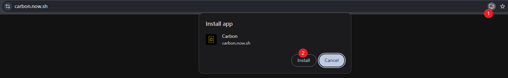

# 一个拥有34.8stars的项目！美化你的代码！
首先，附上项目地址：[Carbon](https://mp.weixin.qq.com/s/_PH5ZjyAfS8dQOFMyBYAQg)

这个项目是这么描述自己的：
> 🖤 Create and share beautiful images of your source code

## 项目简介
Carbon是一个开源项目，它能够轻松地将你的源码生成漂亮的图片并分享。还等什么呢？用这个新发现的美化工具秀给你的 followers 看吧。

## 使用方式
### 快速使用
访问 Carbon 的在线编辑器网站 https://carbon.now.sh

### 导入
有几种不同的方法可以将代码导入到 Carbon：

- 把文件拖放到编辑器中
- 在 carbon url 后面添加 GitHub gist id （比如 carbon.now.sh/<你的_gist_id>）
- 直接粘贴代码
### 定制

你可以定制你的代码，说起来有点奇怪，意思就是，定制背景颜色、字体颜色、等等都不在话下，如图所示：

### 导出
在定制完成之后，你就可以导出了，点击“Export”按钮，就可以导出生成的代码图片。你可以选择导出的格式、尺寸等，然后保存到本地或者直接分享到社交平台。

### 离线使用
如果你使用的是 Google Chrome 或别的支持 PWA 技术的浏览器，可以安装 Carbon 并离线使用：
1. 访问 https://carbon.now.sh
2. 点击浏览器的设置按钮
3. 点击 "安装 Carbon..."

## 社区
> 可能你觉得，还是太麻烦了，我就想当宝宝，请“喂我嘴里”

没关系，别人早就想到了！且看社区，里面提供了相关的优质项目

## 使用效果
废话少数，接下来附上经过carbon美化的图片

.png)

.png)

.png)

> 你以为它只能做这点？那你就错了，这只是冰山一角，剩下的，留给你们发掘了，等你导出图片之后，接下来，请分享到你的社区平台吧！！！