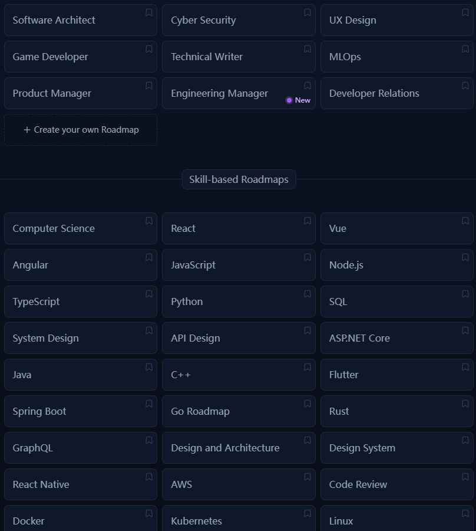
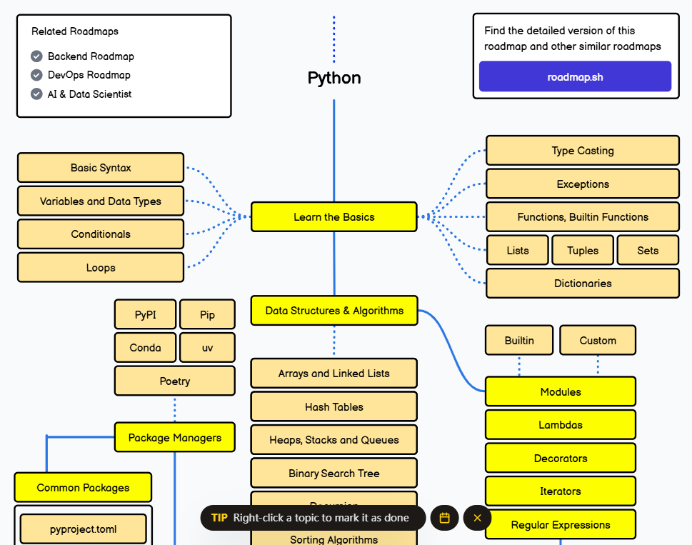
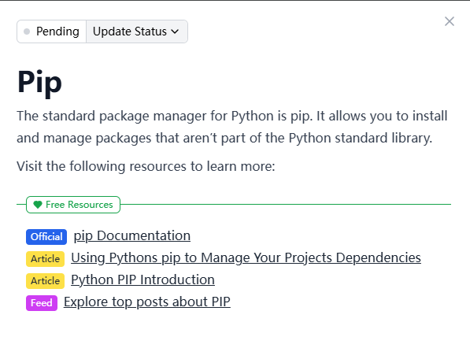
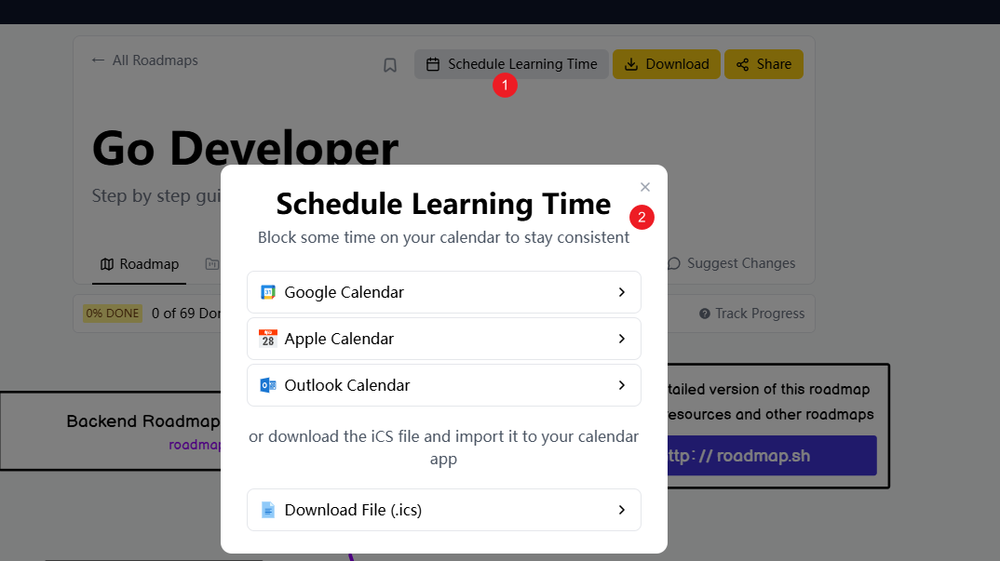
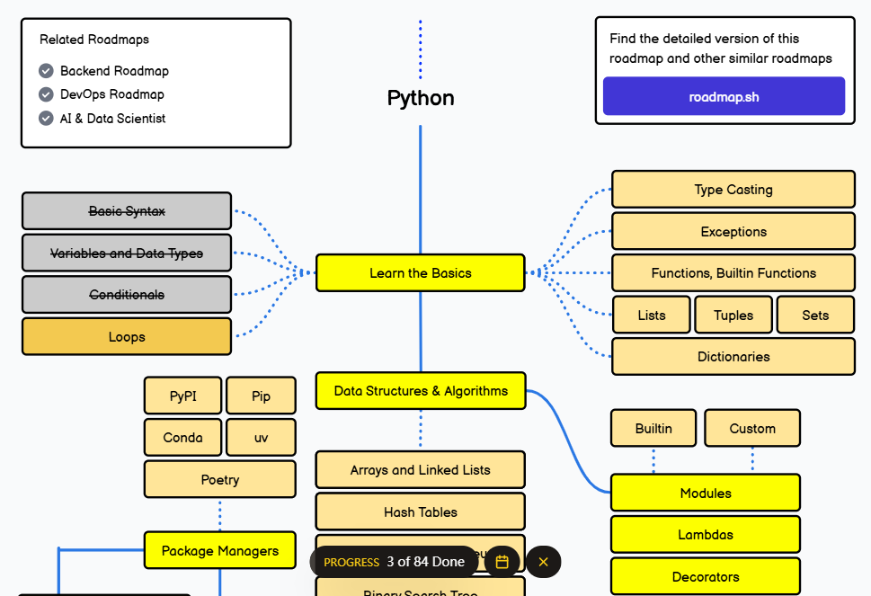

developer-loadmap是一个交互式路线图、指南和其他教育内容，帮助开发人员在职业生涯中成长的[项目](https://github.com/kamranahmedse/developer-roadmap)。
可以在[官网](https://roadmap.sh/) 中查看

这里面包含了很多种编程语言，并附上了相关的路线图（以python为例）。

比如，我看到了python中`pip` 我不太了解，那么，我点一下，就会在右边出现`pip` 的相关描述、官方文档、文章、热门帖子...

你可以点进去学习一下，是不是很方便😊！

不止如此，你还可以安排学习时间，并导入到日历中（谷歌日历、苹果日历、微软），或者你可以直接下载`.ics`后缀的文件，然后再导入日历。

不仅如此，这个网站还提供了很多实用的功能：

1. 进度追踪
你可以标记(右键点击主题就可以标记了，需要登录)已经学习过的知识点，系统会自动记录你的学习进度。这样你就能清晰地知道自己在整个学习路线中的位置。

2. 学习资源推荐
每个知识点都配备了精选的学习资源，包括：
- 官方文档链接
- 优质教程推荐
- 相关视频课程
- 实践项目建议

3. 个性化学习路线
你可以根据自己的兴趣和目标，选择不同的学习路径：
- 前端开发路线
- 后端开发路线
- DevOps路线
- Android开发路线
- ...等等

4. 社区互动
还可以和全球的开发者交流学习心得，讨论技术问题。

总的来说，这是一个非常棒的学习平台，特别适合想要系统学习编程的朋友。它不仅告诉你"学什么"，还告诉你"怎么学"，帮你规划好整个学习路径。

记住网址：roadmap.sh，开启你的学习之旅吧！🚀