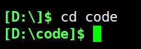
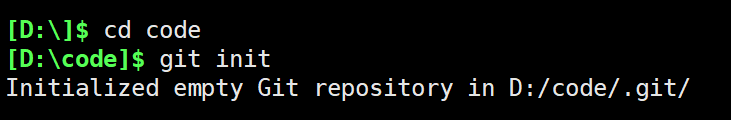

### Unlocking Git: A Developer's Journey

如果你正在阅读本文，说明你可能对 Git 已经有了一些基础了解，或者对它的实际使用感到些许困惑。如果你对 Git 操作仍然有些畏惧，那么请继续阅读 😊 我将带你用简单的方式入门。

------

### 前言

在我了解git之前，各位可以想象我是怎么在GitHub上提交代码或者其他东西的😁 不怕大家笑话，我是直接在GitHub上面`Upload files` , 现在看来确实有点幼稚了😂😂😂 先不说别的，就光建一个文件夹然后管理它都费劲，我列举几个例子各位就知道了

1. **文件大小限制**：通过网页上传文件时，单个文件或文件夹大小受限。
2. **难以追踪修改内容**：无法清楚地了解每次修改的具体内容。
3. **无法按阶段上传**：当我还未完成全部代码时，想暂时保存或展示进展并不方便。
4. **缺乏版本管理**：多次修改后，很难还原到早期版本。

> 不过，没关系！通过这篇文章，你可以快速入门并掌握 Git 的基础操作。
>
> **阅读完本文，你将学会以下内容：**
>
> 1. 克隆远程项目到本地。
> 2. 使用几个简单的 Git 命令，完成项目的提交操作。

本文还将提供必要的工具下载链接、基础命令说明以及简单的实践案例。

------

### 前提

开始之前，你需要完成以下准备工作：

1. **安装 Git**。
2. **注册一个免费的 GitHub 账户**。

------

### 下载并安装 Git

1. 进入[git官网](https://git-scm.com/)， 根据自己的操作系统下载对应的git
2. 下载完成进行安装
3. 一般来说我都是习惯安装在C盘（个人觉得没必要安装在其他盘，有时候挺麻烦的，比如重置电脑的时候。我的其他盘都是放资料……），直接一直点下一步，安装完成就可以了

4. 验证安装
    打开终端（命令提示符或 PowerShell），输入以下命令查看 Git 是否安装成功：

   ```shell
   git --version
   ```

   如果正确安装，你会看到类似以下的输出：

   ```
   git version 2.x.x
   ```

------

> **注意**
>
>顺便说一句：git 和 GitHub**不是**一回事。 Git 是一款开源版本控制工具，由 Linux 操作系统开发人员于 2005 年创建； GitHub 是一家成立于 2008 年的公司，生产与 git 集成的工具。使用 git 不需要 GitHub，但是不使用 git 就无法使用 GitHub。 GitHub 还有许多其他替代品，例如 GitLab、BitBucket，以及“托管您自己”的解决方案（例如 gogs 和 gittea）。所有这些在 git-speak 中都被称为“远程”，并且都是完全可选的。您不需要使用遥控器来使用 git，但它将使与其他人共享您的代码变得更容易。

------

### 第一步：创建本地 Git 仓库

使用 git 在本地计算机上创建新项目时，您将首先创建一个新[存储库](https://git-scm.com/book/en/v2/Git-Basics-Getting-a-Git-Repository)（或通常简称为“repo”）。

要使用 git，我们将使用终端。如果您对终端和基本命令没有太多经验，[请查看本教程](https://ubuntu.com/tutorials/command-line-for-beginners#1-overview)（如果您不想或者需要简短的步骤，请跳到第三步。）

首先，打开终端并使用 cd（更改目录）命令移动到本地计算机上要放置项目的位置。例如，如果您的D盘上有一个“code”文件夹，您可以执行以下操作：

1. **进入目标目录**
    打开终端并使用 `cd` 命令定位到希望存放项目的目录。例如，假设你在 D 盘创建了一个名为 `code` 的文件夹，可以使用以下命令：

   ```shell
   cd D:\code
   ```
   

2. **初始化 Git 仓库**
    使用以下命令初始化一个 Git 仓库：

   ```shell
   git init
   ```

   运行后，当前目录将被初始化为一个 Git 仓库，并生成一个隐藏的 `.git` 文件夹。

------

### 第二步：克隆远程项目

如果你希望从 GitHub 或其他平台获取已有项目到本地，可以使用 `git clone` 命令：

```shell
git clone <远程仓库地址>
```

例如，克隆 GitHub 上的某个项目：

```shell
git clone https://github.com/user/repo.git
```

执行后，项目会被下载到当前目录。

------

### 第三步：将文件添加到暂存区

在修改或新增文件后，需要将它们添加到 Git 的暂存区以便提交。

1. **添加单个文件**

   ```shell
   git add <文件名>
   ```

   示例：

   ```shell
   git add main.py
   ```

2. **添加所有文件**

   ```shell
   git add .
   ```

   此命令会将当前目录下的所有修改添加到暂存区。

3. **查看文件状态**
    使用以下命令检查当前工作区的状态：

   ```shell
   git status
   ```

   你将看到哪些文件被添加到了暂存区。

------

### 第四步：提交更改

完成修改并添加到暂存区后，接下来，是时候创建您的第一个提交了！！！！！！ 

运行命令 `git commit -m "双引号写提交相关的信息"`，建议写(因此，如果您想对更改留下清晰的解释，这对未来的你非常有帮助。试图弄清楚为什么几年前做出了这一些改变。)，如果没有写的话请自行谷歌，在这里就不过多赘述了。

**提交信息**应该清晰地描述本次更改的目的。例如：

```shell
git commit -m "修复登录页面的显示问题"
```

> **建议**
>  提交信息应尽量简洁明确，以便于后续代码维护时理解变更的原因。

## push上仓库
1. 确保你已经在本地仓库中进行了提交：
2. 将本地更改推送到远程仓库：
 ```shell
 git push origin <分支名>
 ```
例如，如果你在 main 分支上工作，可以使用
```shell
git push origin main
```
