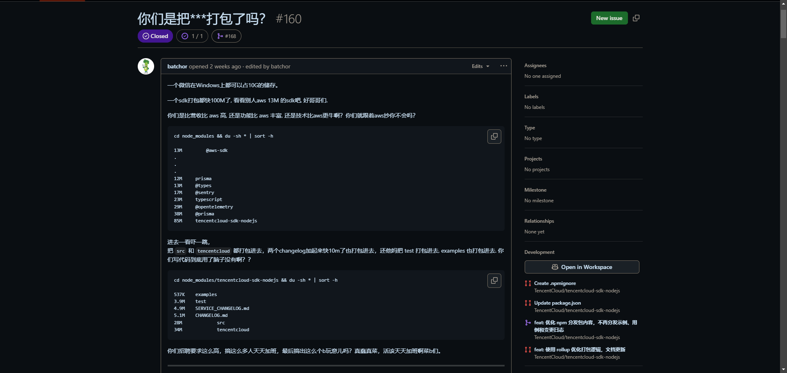
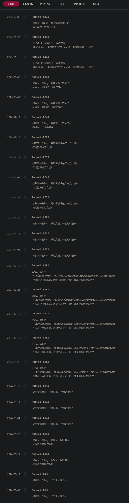

###### 1. 关于Tencent Cloud

（之前早就发生了，只是觉得有趣，今天才想着建个精选，分享一下😉

有用户对于NodeJS SDK 的体积问题提出了Issues，局部如下：

在这里附上他的[地址](https://github.com/TencentCloud/tencentcloud-sdk-nodejs/issues/160)，感兴趣的可以去看看

并且腾讯云已经回应sdk体积过大的问题：

Tencent Cloud 组织成员 ZhiQiang Fan (https://github.com/zqfan) 就NodeJS SDK 的体积问题给大家造成困扰致歉并表示SDK 提供了全产品总包和产品按需分包两种使用方式。提Issues用户在 AWS 使用的是按需分包的方式，而在腾讯云使用了总包的方式，故体积显得较大。

目前腾讯云已优化 npm 分发包内容，不再分发示例、用例和变更日志。

###### 2. bilibili更新情报

下载bilibili时，看到他的更新日志，差点笑喷了😄

###### 3. Zyphra推出开源文本转语音模型，仅需几秒音频即可克隆声音

Zyphra发布了两款开源的文本转语音（TTS）模型Zonos，仅需5秒的样本音频即可克隆用户声音。模型基于1.6亿参数，训练数据超过20万小时，涵盖多种语言和表达方式。其中一款采用纯Transformer架构，另一款结合了Transformer和Mamba架构，后者在生成速度上提升了20%。目前支持中文。

[Zyphra](https://www.zyphra.com/post/beta-release-of-zonos-v0-1)｜[部署教程](https://www.theregister.com/2025/02/16/ai_voice_clone/)

###### 4. 研究人员训练 AI 解读动物情绪

研究人员正训练人工智能识别动物的情绪变化。通过分析猪、狗、马等动物的面部照片，AI 系统能识别出它们痛苦、生病或情绪低落的迹象，并通知饲养员或主人。

这种技术依赖于人类对动物行为的初步识别，但近期研究表明，AI 甚至能够自主学习区分动物在手术前后及服用止痛药前后的面部变化，准确率可达88%。
(https://www.science.org/content/article/can-ai-read-pain-and-other-emotions-your-dog-s-face)
